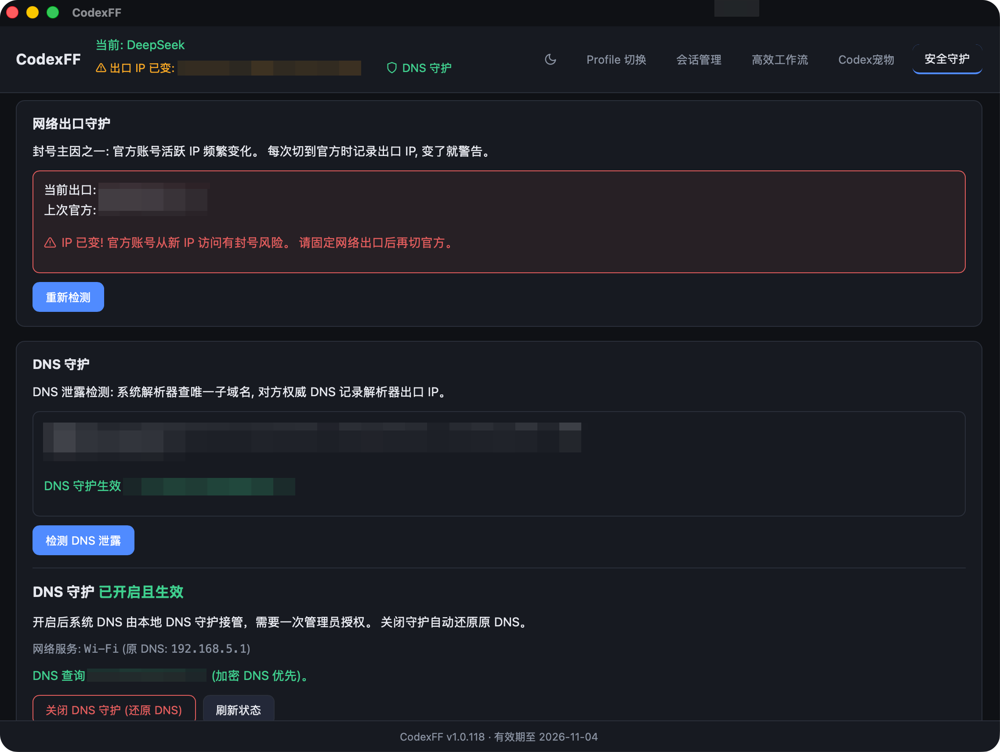
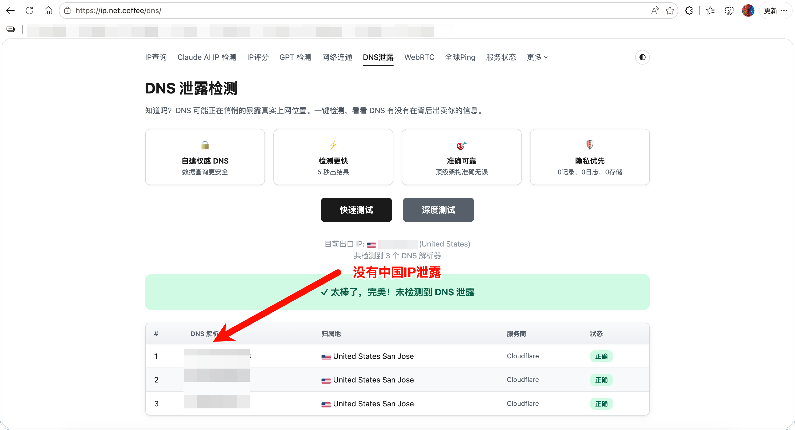
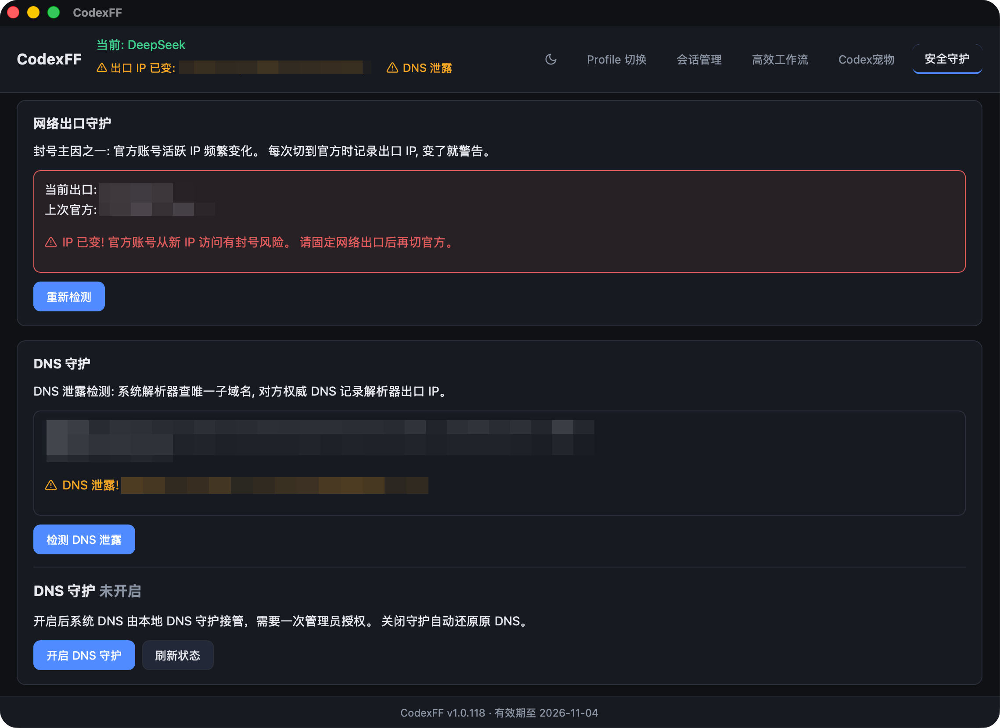
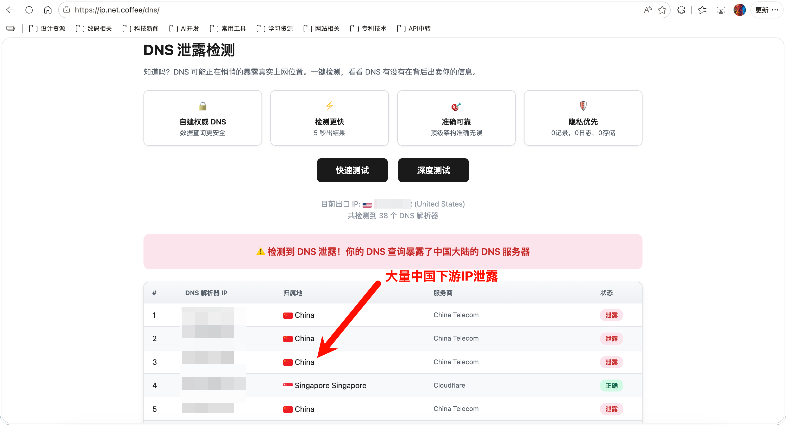

# CodexFF（免费版）

Codex 供应商切换与本地安全小工具（macOS · Tauri 2 + React + Rust）。

## 功能

- **一键切换**：官方订阅与第三方供应商（中转站/自建）无缝切换，失败自动回滚
- **凭证物理隔离**：官方凭证只在官方模式下出现在 `~/.codex/auth.json`；切到第三方时官方凭证被移入金库并从磁盘物理移除，第三方 key 走系统钥匙串
- **统一会话历史**：官方与第三方共享同一会话列表；旧官方会话可迁入共享历史，迁移前自动备份、随时可还原
- **会话管理**：列表 / 搜索 / 详情，支持按线程隔离——勾选后官方订阅下不可见该线程全部会话（含侧边栏项目/目录与本地索引），切回第三方自动恢复
- **Codex 宠物**：导入 / 管理 / 终端命令一键安装社区宠物
- **高效工作流**：Luna / Sol 等模型预设一键配置，支持自定义模型与恢复默认
- **用量统计**：第三方余额、Token 用量统计，随供应商卡片自动更新
- **网络守护（基础版）**：DNS 泄露检测、IP 指纹守护、本地路由
- **界面**：深色 / 浅色模式（跟随系统 + 手动切换）

## 与 CodexFF Pro 的关系

免费版是 CodexFF Pro 的功能子集，不含 DNS 守护（加密解析/防污染）、激活码/彩蛋等付费功能。
体验完整版 CodexFF Pro：https://code.etony.ccwu.cc/

| 开启 DNS 守护 | 开启后第三方权威检测（无泄露） |
| --- | --- |
|  |  |
| 关闭 DNS 守护 | 关闭后第三方权威检测（DNS 泄露） |
|  |  |

## 致谢

部分实现参考 [CC Switch](https://github.com/farion1231/cc-switch)（MIT License, Copyright Jason Young）。
宠物功能参考社区宠物生态，具体来源（作者/仓库名）见应用内宠物页。

## 开发

```bash
npm install
npm run tauri dev
```

## 构建

```bash
# macOS .app
npm run build:app

# DMG（含安装说明）
./scripts/build-dmg.sh
```

## 测试

```bash
cd src-tauri && cargo test
```

## 免责声明

请遵守 OpenAI 与各 API 提供方的使用条款。本工具不内置任何破解、绕过或违规功能；使用第三方服务产生的风险由使用者自行承担。请勿将你的官方凭证交给任何第三方。

## License

[MIT](LICENSE)
